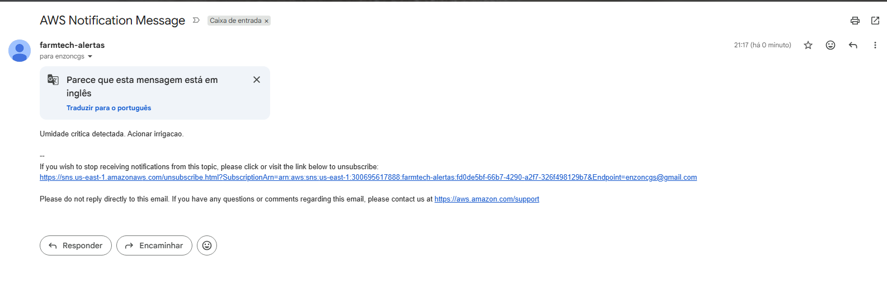
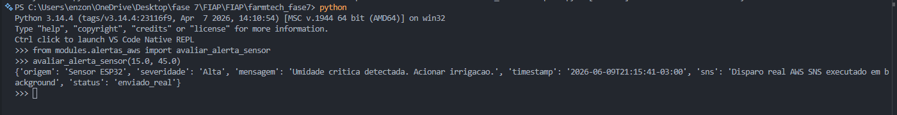

# 🌾 FarmTech Solutions - Integração Final (Fase 7)

## 🎥 Apresentação do Projeto
> **Assista ao vídeo de demonstração (10 minutos) com todas as funcionalidades:** > https://youtu.be/PyV5Fa3vzgw

---

## 🚀 Visão Geral e Arquitetura do Sistema
Este repositório consolida a evolução da plataforma FarmTech Solutions, integrando todas as entregas das Fases 1 a 6 num único *dashboard* interativo e funcional desenvolvido em Python (Streamlit). A arquitetura foi desenhada para garantir alta coesão e baixo acoplamento entre os módulos analíticos, de IoT, de inteligência artificial e serviços em nuvem.

### Integração das Fases (1 a 6) no Dashboard:
* **Fase 1 (Meteorologia e Análise de Dados):** Integração de *scripts* em R via subprocessos no Python. O painel gera e processa séries temporais climáticas, apresentando a evolução do clima e a matriz de correlação estatística através de gráficos interativos.
* **Fases 2 e 3 (IoT, Sensores e Banco de Dados):** Simulação de leituras de sensores agrícolas (inspirado em ESP32) utilizando Programação Orientada a Objetos. Os dados gerados e os alertas de anomalias são persistidos localmente num banco de dados SQLite (`farmtech.db`).
* **Fase 4 (Dashboard Interativo):** O front-end consolidado (UI/UX) foi desenvolvido em Streamlit, utilizando Plotly para a renderização de gráficos dinâmicos de umidade, temperatura e distribuição de área por cultura.
* **Fase 6 (Visão Computacional):** Implementação de um módulo de inferência visual (*Mock* de Alta Fidelidade baseado em YOLO/Redes Neurais). O sistema consome imagens reais da lavoura a partir do disco, analisa os ativos e emite diagnósticos fitossanitários com métricas de confiança, diretamente na interface.

---

## ☁️ Serviço de Mensageria e Alertas (AWS - Fase 5)
Para garantir a resposta rápida a incidentes na lavoura, implementámos um serviço de mensageria na infraestrutura AWS. O sistema monitoriza as leituras dos sensores (humidade e temperatura) e os diagnósticos críticos da Visão Computacional.

Quando um limiar crítico é ultrapassado, o fluxo de comunicação é acionado:
1. O evento é capturado pelo sistema e persistido no SQLite.
2. É disparado um alerta através do **Amazon SNS** (Simple Notification Service).
3. Os funcionários da fazenda recebem a notificação por E-mail/SMS com as devidas ações corretivas recomendadas.

### Evidências da Solução AWS
*(Abaixo encontram-se os prints que comprovam a infraestrutura e o recebimento dos alertas)*


> **Descrição:** E-mail/SMS recebido pelo funcionário com a notificação do alerta gerado pela plataforma.


> **Descrição:** Configuração do Tópico SNS e subscrições na consola da AWS.

---

## ⚙️ Como Executar o Projeto Localmente

**Pré-requisitos:** Python 3.10+ e ambiente virtual configurado. (Opcional: R instalado e configurado nas variáveis de ambiente para o motor de fallback).

1. Clone este repositório.
2. Instale as dependências necessárias:
   ```bash
   pip install pandas plotly streamlit
   ```
3. Na raiz do projeto, execute o comando de inicialização:
   ```bash
   streamlit run app.py
   ```
4. Aceda ao painel através do navegador no endereço http://localhost:8501.

---

## 👨‍🎓 Integrantes
| Nome | RM | E-mail |
|------|-----|--------|
| **Fabrício Mouzer Brito** | RM566777 | fabriciomouzer@hotmail.com |
| **Enzo Nunes Castanheira Gloria da Silva** | RM567599 | enzoncgs@gmail.com |
| **Larissa Nunes Moreira Reis** | RM568280 | larissa.nmreis@gmail.com |
| **Gabriel Rapozo Guimarães Soares** | RM568480 | rapozogabriel8@gmail.com |
